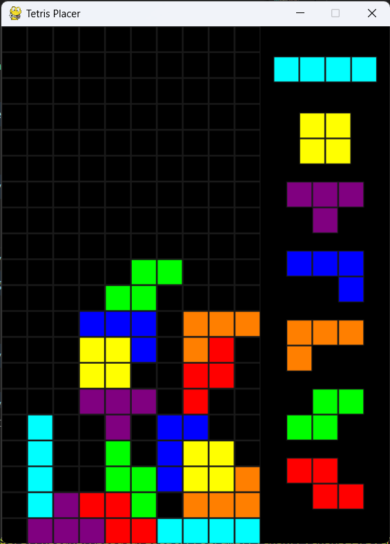

# tetris-placer

테트리스 빌드를 연구할 수 있도록 자유롭게 테트로미노들을 배치할 수 있는 툴입니다.

## How to run?

우선 이 프로젝트의 폴더를 다운로드 받아주세요.  

이 프로젝트는 [pygame](https://github.com/pygame/pygame)에 의존성이 있습니다. 다음 명령어를 사용해 설치할 수 있습니다.

```powershell
pip install pygame
```

이후 `main.py`를 실행하면 됩니다.

```powershell
cd tetris-placer
python src/main.py
```

아래와 같이 `--col` 옵션을 사용해 보드의 컬럼 수를 조정할 수도 있습니다.

```powershell
python src/main.py --col=20
```

아래와 같이 `--mix` 를 사용하면 가방을 섞을 수 있습니다.

```powershell
python src/main.py --mix
```

## How to use?

- Mouse Left Click (And Drag): Place 1x1 block
- Mouse Right Click (And Drag): Remove 1x1 block
- Drag and Drop: Place tetrimino
- C: Rotate clockwise
- X: Rotate counterclockwise
- A: Rotate 180 degrees
- Ctrl + Z: Undo
- Ctrl + Y: Redo
- ESC: Restart
- Q: Quit

## Screenshots


