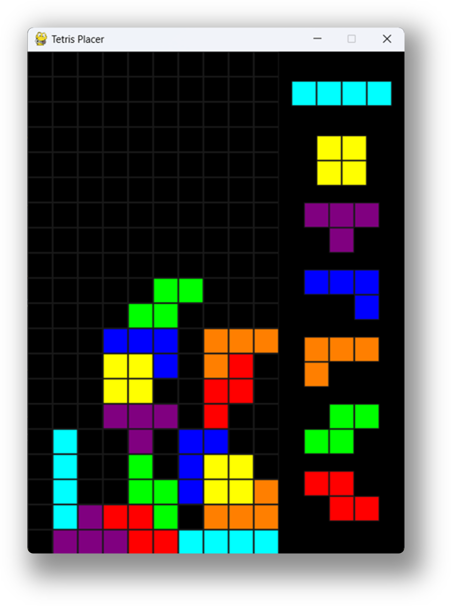

# tetris-placer

테트리스 빌드를 연구할 수 있도록 자유롭게 테트로미노들을 배치할 수 있는 툴입니다.

## How to run?

[pygame](https://github.com/pygame/pygame)에 의존성이 있습니다. 다음 명령어를 사용해 설치할 수 있습니다.

```powershell
pip install pygame
```

이후 `main.py`를 실행하면 됩니다.


## How to use?

- `마우스 왼쪽 버튼`을 사용해 테트로미노를 드래그하여 배치할 수 있습니다.
- `x`키를 사용해 테트로미노를 시계 방향으로 회전할 수 있습니다.
- `Ctrl + z`키를 사용해 이전 행동을 취소할 수 있습니다.
- `Ctrl + y`키를 사용해 이전 행동을 다시 실행할 수 있습니다.

## Screenshots


